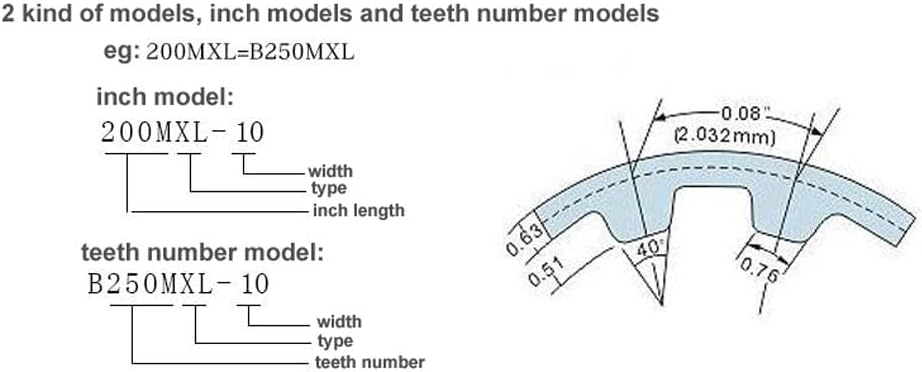

# MALYAN-M180-Mantenimiento
Información sobre uso y mantenimiento de la impresora 3D Malyan M180 3D Printer

## Correas 
Lleva las de tipo MXL. Una correa síncrona clásica, de dientes trapezoidales,  con un paso de 0,08” (2,032 mm) recomendada para aplicaciones que requieren una
sincronización máxima, un espacio reducido y velocidades elevadas. Esta
correa muy estable permite un ahorro de espacio y constituye por eso la
solución ideal para transmisiones de precisión, como en máquinas de oficina
y ordenadores.

 Se las puede identificar por el perímetro en pulgadas: 
 - Ejemplo, para el eje Y: Correa 220MXL (220=22.0 pulgadas de perímetro) 

o por el número de dientes: 
- Ejemplo, la misma correa sería: B275MXL (275 dientes)

O sea, decir 220MXL es igual que B275MXL

### Eje X: 
- Una correa sincrónica 320MXL. Es de 400 dientes, paso de 0.08" (2.033 mm) y perímetro de 32" (812.8 mm) 
- 
- Distancia aproximada entre ejes (medida desde afuera con una regla), alrededor de 40 cm
  
### Eje Y:
- Dos correas sincrónicas cerradas 220MXL. Son de 275 dientes, paso de 0.08" (2.033 mm) y perímetro de 22" (558.8 mm) 
  
- Una correa sincrónica cerrada 72MXL. Es de 90 dientes, paso de 0.08" (2.033 mm) y perímetro de 7.2" (182.88 mm)
       
En todos los casos son de 5 mm de ancho
